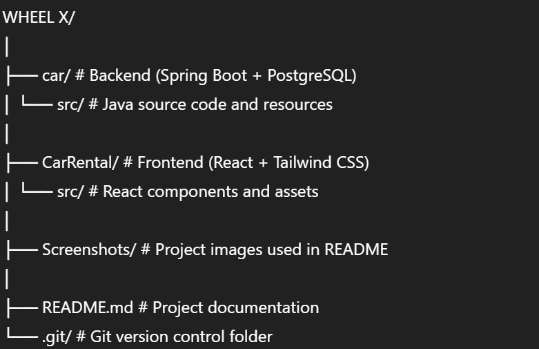
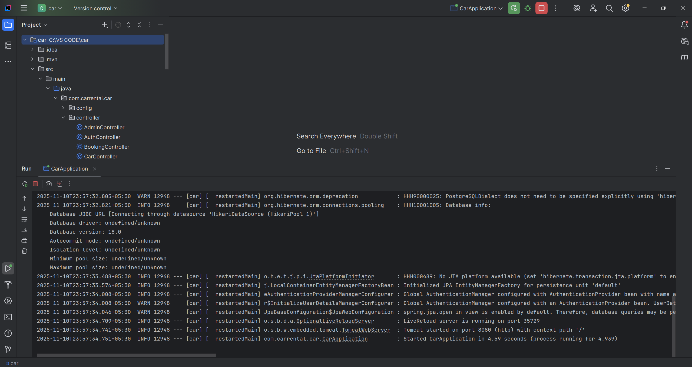

🚗 Car Rental Management System — WheelX

📘 Overview

WheelX is a full-stack web application designed to simplify car rental management.
Users can browse available cars, book rentals, and manage their bookings efficiently.
It uses Spring Boot for the backend, React + Tailwind CSS for the frontend, PostgreSQL for database management, and Cloudinary for image hosting.

🏗️ Project Structure

⚙️ Tech Stack
| Layer              | Technology                                  |
| ------------------ | ------------------------------------------- |
| **Frontend**       | React.js, Tailwind CSS                      |
| **Backend**        | Spring Boot (Java)                          |
| **Authentication** | JWT (JSON Web Token)                        |
| **Database**       | PostgreSQL                                  |
| **Cloud Storage**  | Cloudinary                                  |
| **Tools**          | IntelliJ IDEA (backend), VS Code (frontend) |

🚀 Setup Instructions:-

1️⃣ Clone the Repository
git clone https://github.com/Vanshkamboj1/CAR-RENTAL

cd your-repo-name

2️⃣ Backend Setup (Spring Boot) (Folder - Car)
Install Dependencies

Make sure you have:
Java 17+,Maven

Configure Environment Variables:
Create a .env file in the backend root directory:

    DB_URL=your_database_url
    JWT=your_secret_key
    CLOUDINARY_URL=your_cloudinary_url

Run Backend

mvn spring-boot:run

3️⃣ Frontend Setup (Folder - CarRental)
Install Dependencies

cd CarRental

npm install

npm start

4️⃣ Database Setup

Use PostgreSQL (or Neon DB if deployed)

Create a database and update DB_URL accordingly

Example:
jdbc:postgresql://localhost:5432/car_rental

⚠️ Important: Never commit your real API keys or passwords to GitHub.

📸 Screenshots
⚙️ Backend Running in IntelliJ IDEA

🏠 Frontend — Home Page

🚗 Frontend — Available Cars Page

📋 Admin — All Bookings Page

🧠 Key Features
🔐 Secure JWT-based authentication
🚘 Dynamic car listings with images (via Cloudinary)
📅 Booking management with start/end dates and pricing
🧾 Admin panel to manage cars and bookings
🌐 Responsive UI built using React + Tailwind CSS

💡 Developer Notes
Run backend and frontend separately:
Backend → IntelliJ IDEA
Frontend → VS Code
Ensure PostgreSQL is running before launching the backend.
Update your database and Cloudinary credentials in application.properties.

👨‍💻 Author

Vansh Kamboj
https://github.com/Vanshkamboj1

📜 Copyrights
© Vansh Kamboj
All rights reserved.

🧾 License

This project is created for academic and educational purposes.
Unauthorized redistribution or commercial use is prohibited.